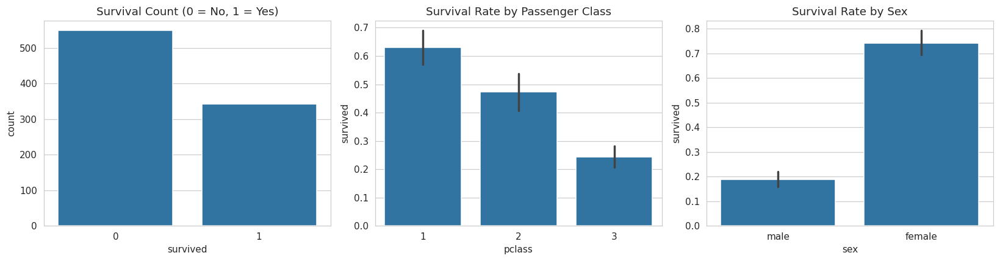
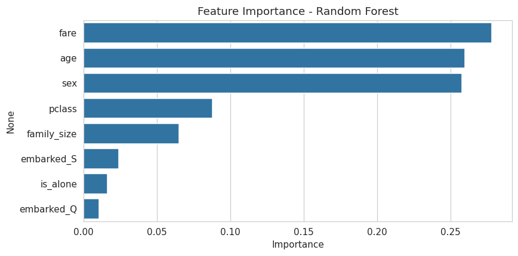

# Titanic Survival Prediction

A machine learning project that explores the Titanic passenger dataset and builds models to predict survival based on passenger characteristics like class, sex, age, and fare.

## Why this project

I built this to practice the full data science workflow end-to-end: exploratory data analysis, handling missing data, feature engineering, and comparing multiple models with proper cross-validation — not just fitting a model and reporting one accuracy number.

## Dataset

891 Titanic passengers, 15 raw features (class, sex, age, fare, family relationships, port of embarkation, etc.), sourced via `seaborn.load_dataset("titanic")`.

## What's inside

- **Exploratory Data Analysis** — survival rates by class, sex, age, and fare, visualized with `seaborn`/`matplotlib`
- **Feature engineering** — class-aware imputation for missing ages, family size, "traveling alone" flag, one-hot encoding for embarkation port
- **Model comparison** — Logistic Regression vs. Random Forest, evaluated with 5-fold cross-validation (not just a single train/test split)
- **Evaluation** — confusion matrix, precision/recall/F1, and feature importance ranking

## Results

| Model | Test Accuracy | Cross-Val Accuracy |
|---|---|---|
| Logistic Regression | 80.4% | 80.2% (± 3.2%) |
| Random Forest | 79.9% | 78.7% (± 5.0%) |

**Key finding:** sex, fare, and passenger class were the strongest predictors of survival — consistent with the historical "women and children first" policy and wealthier passengers having cabins closer to lifeboats. Logistic Regression narrowly outperformed Random Forest, a good reminder that simpler models can match more complex ones on small, largely linear datasets.

### Sample visualizations

**Survival by class, sex, and overall count**


**Feature importance (Random Forest)**


## How to run it

```bash
git clone https://github.com/<your-username>/titanic-survival-prediction.git
cd titanic-survival-prediction
pip install -r requirements.txt
jupyter notebook titanic_survival_prediction.ipynb
```

## Tech stack

Python · pandas · scikit-learn · seaborn · matplotlib · Jupyter

## Possible next steps

- Hyperparameter tuning with `GridSearchCV`
- Try gradient boosting (XGBoost / LightGBM)
- Extract passenger titles (Mr./Mrs./Master) from names as an additional feature

## License

MIT — see [LICENSE](LICENSE)
